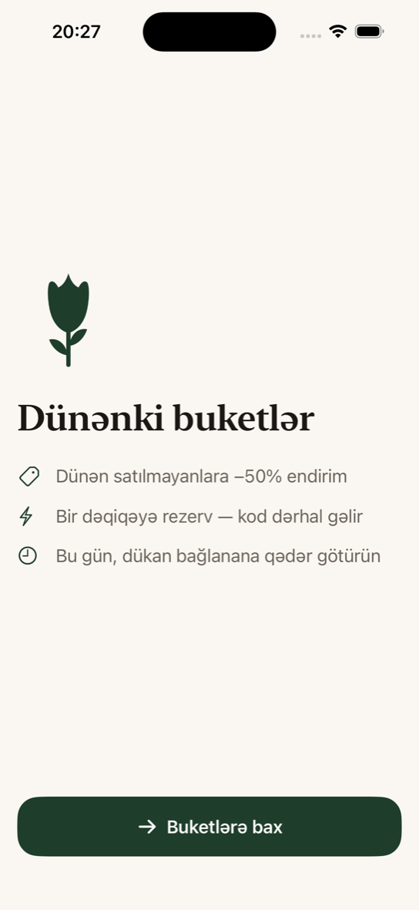
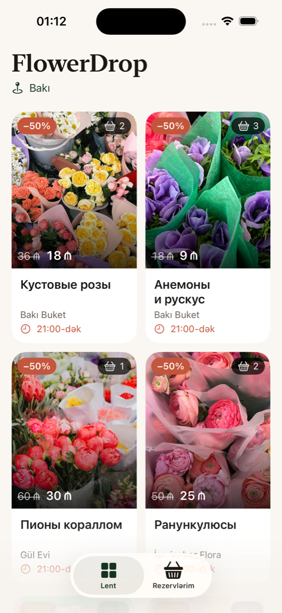
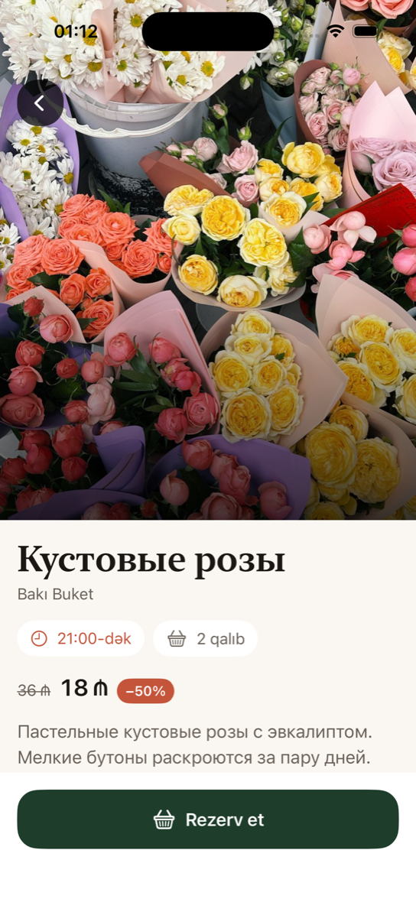
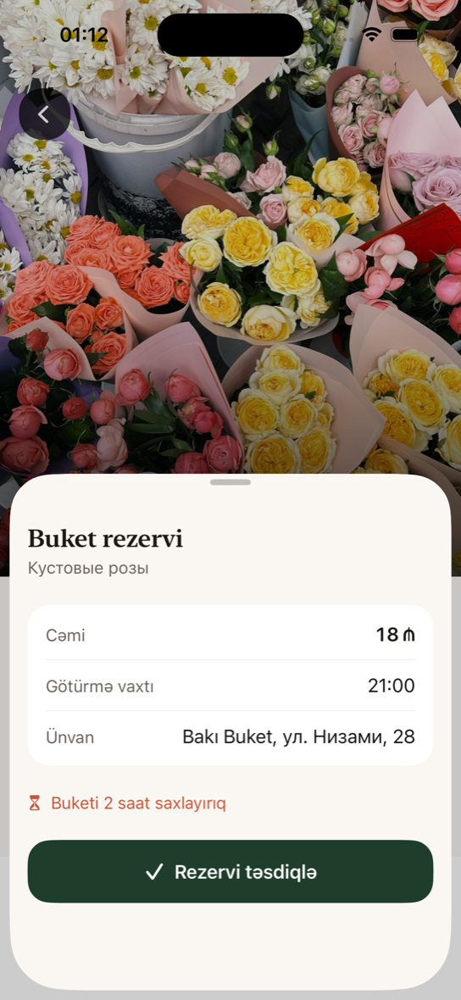
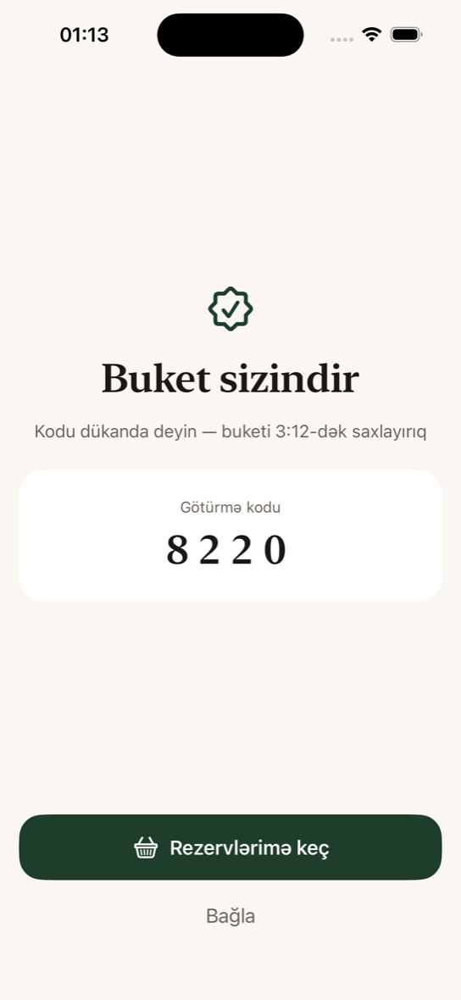
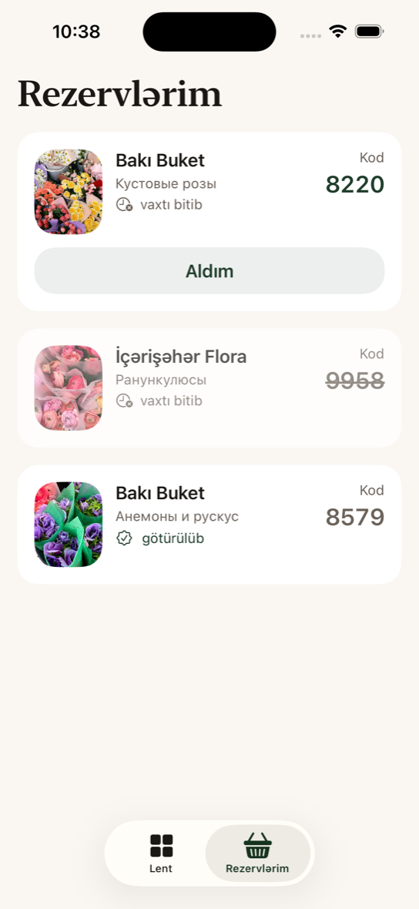

# FlowerDrop — iOS

[](https://github.com/5exclamations/flowerdrop-ios/actions/workflows/ci.yml)

Маркетплейс «вчерашних» букетов со скидкой −50%. Лавки Баку выкладывают то, что
осталось к вечеру; покупатель резервирует букет с телефона и забирает его до
закрытия. Это клиент; сервер живёт в отдельной репе —
[flowerdrop-backend](https://github.com/5exclamations/flowerdrop-backend).

|            |            |            |
| :--------: | :--------: | :--------: |
|  |  |  |
| Знакомство | Лента | Букет |
|  |  |  |
| Резерв | Код получения | Мои резервы |

Скриншоты сняты в азербайджанской локали. Названия букетов приходят с сервера и
пока существуют только на русском — языковых полей в API нет.

## Что умеет

- **Лента дня.** Двухколоночная сетка карточек: фото 4:5 edge-to-edge, скидка,
  остаток и дедлайн самовывоза поверх фото. Pull-to-refresh, скелетоны при
  загрузке, задизайненные empty state и экран ошибки.
- **Экран букета.** Фото на всю ширину, цена со старой зачёркнутой, лавка,
  адрес, время до закрытия и остаток.
- **Резерв в два тапа.** Sheet со сводкой (сумма, до скольки забрать, адрес),
  затем экран с кодом получения — его называют в лавке.
- **Вход по номеру.** `+994`, код из SMS в четыре ячейки, токен в Keychain.
  Логин запрашивается только в момент резерва, а не на старте.
- **Мои резервы.** Активные с обратным отсчётом до истечения, просроченные и
  уже полученные; кнопка «Забрал».
- **Две локали.** Русский и азербайджанский, 69 строк в `Localizable.xcstrings`.
  Валюта, разделители разрядов и время — из локали, не захардкожены.
- **Тёмная тема** с первого дня: все цвета семантические, из каталога ассетов.

## Стек

- SwiftUI, iOS 17+, только портрет, iPhone
- MVVM, `@Observable`, async/await, `URLSession` — **без сторонних зависимостей**
- Проект генерируется [XcodeGen](https://github.com/yonaskolb/XcodeGen) из
  `project.yml`; `.xcodeproj` в репозиторий не коммитится
- Собственная дизайн-система в `Core/DesignSystem` — один радиус, сетка 8pt,
  токены цвета и типографики; магические значения в вёрстке запрещены
- Токен в Keychain, адрес бэкенда — из `Info.plist` по build-конфигурации:
  Debug смотрит на `localhost` по HTTP, Release — только HTTPS

## Как собрать

Нужны Xcode 16+ и XcodeGen (`brew install xcodegen`).

```bash
git clone https://github.com/5exclamations/flowerdrop-ios.git
cd flowerdrop-ios
xcodegen generate
open FlowerDrop.xcodeproj
```

Схема `FlowerDrop`, симулятор iPhone 16. Конфигурация Debug ходит на
`http://localhost:8000` — подними
[бэкенд](https://github.com/5exclamations/flowerdrop-backend) и засей демо-данные,
иначе лента будет пустой:

```bash
docker compose up --build
docker compose exec web python manage.py seed_demo
```

Код из SMS в dev-режиме всегда `1111`.

Чтобы посмотреть приложение в азербайджанской локали, не трогая настройки
симулятора:

```bash
xcrun simctl launch "iPhone 16" com.texa.flowerdrop -AppleLanguages "(az)" -AppleLocale az_AZ
```

## Структура

```
FlowerDrop/
  Core/
    DesignSystem/    токены, карточка, кнопка, скелетон, чипы
    Network/         APIClient за протоколом + реальная и мок-реализации
    Storage/         Keychain
  Features/
    Onboarding/      экран знакомства, показывается один раз
    Feed/            лента, карточка, фото-оверлеи
    BouquetDetail/   экран букета
    Auth/            телефон, код, стор авторизации
    Reservation/     подтверждение, успех, мои резервы
  Resources/         Assets.xcassets, Localizable.xcstrings
```

Контракт API описан в [API_CONTRACT.md](API_CONTRACT.md), дизайн-решения —
в [DESIGN.md](DESIGN.md).
